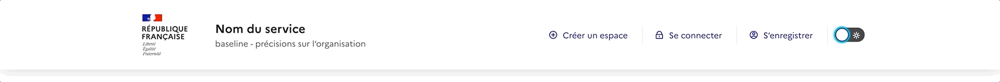

<!-- PROJECT LOGO -->
<div align="center">
  <a href="https://github.com/othneildrew/Best-README-Template">
    
  </a>
  <h3 align="center">Design System - DarkMode</h3>
  

  


</div>

<!-- ABOUT THE PROJECT -->


<br/>


### À propos du site
Site démo permettant l'utilisation du **DarkMode** sous React, dans l'écosystème du Design System de l'État, avec comme exemple un Header.

### Prérequis

Ceci est un exemple de la liste des éléments dont vous avez besoin pour utiliser le site et comment l'installer.
```sh
node + npm ou docker
```

### Installation

Local :

```sh

$ git clone https://github.com/yaniselmaleh/template-ds-react-darkmode.git
$ npm install
$ npm run start
```

Sous Docker :

```sh
# clone
$ git clone https://github.com/yaniselmaleh/template-ds-react-darkmode.git

# build node
$ docker-compose build

# run
$ docker-compose up
```

### Utilisation
Ouvrez **http://localhost:3000** pour l'afficher dans le résultat dans votre navigateur, une fois l'installation faite.


<!-- CONTACT -->
## Contact
[![LinkedIn][linkedin-shield]][linkedin-url1]


<!-- MARKDOWN LINKS & IMAGES -->
[linkedin-shield]: https://img.shields.io/badge/-LinkedIn-black.svg?style=flat-square&logo=linkedin&colorB=555
[linkedin-url1]: https://linkedin.com/in/yaniselmaleh